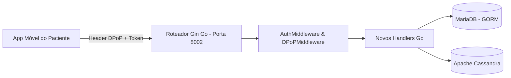

# 🔌 Guia de Integração com o Aplicativo Móvel (Backend)
## Como Expor os Endpoints Necessários para o App do Paciente

> **Repositório:** `sistema_centralizador_de_dados_clinicos_back`  
> **Público:** Desenvolvedores trabalhando na API Go (Gin) para dar suporte a todas as funcionalidades do aplicativo mobile.  
> **Objetivo:** Fornecer código Go pronto, structs, rotas e consultas SQL/GORM para integrar o App com o Barramento Central.

---

## 📑 Índice
1. [Visão Geral da Arquitetura](#1-visão-geral-da-arquitetura)
2. [Funcionalidade 1: CRUD Completo de Exames (`/api/exams`)](#2-funcionalidade-1-crud-completo-de-exames-apiexams)
3. [Funcionalidade 2: Central de Consentimentos LGPD (`/api/users/consents`)](#3-funcionalidade-2-central-de-consentimentos-lgpd-apiusersconsents)
4. [Funcionalidade 3: Trilha de Auditoria do Paciente ("Quem Acessou Meus Dados?")](#4-funcionalidade-3-trilha-de-auditoria-do-paciente-quem-acessou-meus-dados)
5. [Funcionalidade 4: QR Code Temporal de Acesso Rápido Presencial](#5-funcionalidade-4-qr-code-temporal-de-acesso-rápido-presencial)
6. [Funcionalidade 5: Endpoint de Análise por IA (`/api/ai/analyze`)](#6-funcionalidade-5-endpoint-de-análise-por-ia-apiaianalyze)
7. [Como Registrar Todas as Rotas no `main.go`](#7-como-registrar-todas-as-rotas-no-maingo)

---

## 1. Visão Geral da Arquitetura

O aplicativo móvel do paciente se comunica com o backend enviando requisições com dois cabeçalhos de segurança obrigatórios em rotas protegidas:
1. `Authorization: DPoP <access_token>`
2. `DPoP: <dpop_proof_jwt>` (assinado pela chave privada do dispositivo móvel)

O middleware `DPoPMiddleware` e `AuthMiddleware` já existentes extraem o `userID` do paciente e o injetam no contexto do Gin (`c.GetString("userID")`).



---

## 2. Funcionalidade 1: CRUD Completo de Exames (`/api/exams`)

O app precisa listar, enviar, visualizar e excluir exames.

### Arquivo: `services/users/core/http/exam_handler.go` (CRIE ESTE ARQUIVO)

```go
package http

import (
	"fmt"
	"io"
	"net/http"
	"os"
	"path/filepath"
	"time"

	"github.com/TCC-Conjunto-de-Aplicacoes-Medicinais/sistema_centralizador_de_dados_clinicos_back/shared/database"
	"github.com/TCC-Conjunto-de-Aplicacoes-Medicinais/sistema_centralizador_de_dados_clinicos_back/shared/logger"
	"github.com/gin-gonic/gin"
	"github.com/google/uuid"
	"gorm.io/gorm"
)

type ExamHandler struct {
	DB        *gorm.DB
	Logger    *logger.Logger
	UploadDir string
}

func NewExamHandler(db *gorm.DB, l *logger.Logger) *ExamHandler {
	uploadDir := os.Getenv("UPLOAD_DIR")
	if uploadDir == "" {
		uploadDir = "./uploads"
	}
	_ = os.MkdirAll(uploadDir, 0755)

	return &ExamHandler{
		DB:        db,
		Logger:    l,
		UploadDir: uploadDir,
	}
}

// GET /api/exams - Lista todos os exames ativos do paciente autenticado
func (h *ExamHandler) ListPatientExams(c *gin.Context) {
	userID := c.GetString("userID")
	if userID == "" {
		c.JSON(http.StatusUnauthorized, gin.H{"error": "Usuário não autenticado"})
		return
	}

	var exams []database.Exam
	err := h.DB.Where("patient_id = ? AND flag_active = ?", userID, true).
		Order("created_at DESC").
		Find(&exams).Error

	if err != nil {
		c.JSON(http.StatusInternalServerError, gin.H{"error": "Erro ao buscar exames: " + err.Error()})
		return
	}

	c.JSON(http.StatusOK, exams)
}

// GET /api/exams/:id - Detalhes de um exame específico
func (h *ExamHandler) GetExamByID(c *gin.Context) {
	userID := c.GetString("userID")
	examID := c.Param("id")

	var exam database.Exam
	err := h.DB.Where("id = ? AND patient_id = ? AND flag_active = ?", examID, userID, true).First(&exam).Error
	if err != nil {
		c.JSON(http.StatusNotFound, gin.H{"error": "Exame não encontrado"})
		return
	}

	c.JSON(http.StatusOK, exam)
}

// POST /api/exams - Upload multipart de arquivo de exame
func (h *ExamHandler) UploadExam(c *gin.Context) {
	userID := c.GetString("userID")
	if userID == "" {
		c.JSON(http.StatusUnauthorized, gin.H{"error": "Usuário não autenticado"})
		return
	}

	title := c.PostForm("title")
	examType := c.PostForm("exam_type")
	provider := c.PostForm("provider")
	results := c.PostForm("results")

	if title == "" {
		title = "Exame Clínico"
	}

	file, header, err := c.Request.FormFile("file")
	if err != nil {
		c.JSON(http.StatusBadRequest, gin.H{"error": "Arquivo é obrigatório: " + err.Error()})
		return
	}
	defer file.Close()

	examID := uuid.New().String()
	safeFilename := fmt.Sprintf("%s_%s", examID, header.Filename)
	filePath := filepath.Join(h.UploadDir, safeFilename)

	out, err := os.Create(filePath)
	if err != nil {
		c.JSON(http.StatusInternalServerError, gin.H{"error": "Falha ao salvar arquivo no servidor"})
		return
	}
	defer out.Close()
	_, _ = io.Copy(out, file)

	exam := database.Exam{
		Id:          examID,
		PatientId:   userID,
		LinkBucket:  fmt.Sprintf("/api/exams/file/%s/%s", examID, header.Filename),
		IdCassandra: uuid.New().String(),
		FlagActive:  true,
		Title:       title,
		Provider:    provider,
		Result:      results,
		CreatedAt:   time.Now(),
		UpdatedAt:   time.Now(),
	}

	if err := h.DB.Create(&exam).Error; err != nil {
		c.JSON(http.StatusInternalServerError, gin.H{"error": "Erro ao registrar exame no banco: " + err.Error()})
		return
	}

	c.JSON(http.StatusCreated, exam)
}

// GET /api/exams/file/:id/:filename - Download/Stream seguro do arquivo
func (h *ExamHandler) DownloadExamFile(c *gin.Context) {
	examID := c.Param("id")
	filename := c.Param("filename")

	safeFilename := fmt.Sprintf("%s_%s", examID, filename)
	filePath := filepath.Join(h.UploadDir, safeFilename)

	if _, err := os.Stat(filePath); os.IsNotExist(err) {
		c.JSON(http.StatusNotFound, gin.H{"error": "Arquivo físico não encontrado"})
		return
	}

	c.File(filePath)
}

// DELETE /api/exams/:id - Exclusão lógica (soft-delete)
func (h *ExamHandler) DeleteExam(c *gin.Context) {
	userID := c.GetString("userID")
	examID := c.Param("id")

	result := h.DB.Model(&database.Exam{}).
		Where("id = ? AND patient_id = ?", examID, userID).
		Update("flag_active", false)

	if result.Error != nil {
		c.JSON(http.StatusInternalServerError, gin.H{"error": "Erro ao excluir exame: " + result.Error.Error()})
		return
	}
	if result.RowsAffected == 0 {
		c.JSON(http.StatusNotFound, gin.H{"error": "Exame não encontrado ou sem permissão"})
		return
	}

	c.JSON(http.StatusOK, gin.H{"message": "Exame excluído com sucesso"})
}
```

---

## 3. Funcionalidade 2: Central de Consentimentos LGPD (`/api/users/consents`)

O paciente precisa ver quais clínicas pediram acesso e aprovar/revogar.

### Arquivo: `services/users/core/http/consent_handler.go` (CRIE ESTE ARQUIVO)

```go
package http

import (
	"net/http"
	"time"

	"github.com/TCC-Conjunto-de-Aplicacoes-Medicinais/sistema_centralizador_de_dados_clinicos_back/shared/database"
	"github.com/TCC-Conjunto-de-Aplicacoes-Medicinais/sistema_centralizador_de_dados_clinicos_back/shared/logger"
	"github.com/gin-gonic/gin"
	"gorm.io/gorm"
)

type ConsentHandler struct {
	DB     *gorm.DB
	Logger *logger.Logger
}

func NewConsentHandler(db *gorm.DB, l *logger.Logger) *ConsentHandler {
	return &ConsentHandler{DB: db, Logger: l}
}

// GET /api/users/consents - Lista permissões ativas e histórico
func (h *ConsentHandler) ListConsents(c *gin.Context) {
	userID := c.GetString("userID")

	var permissions []database.DoctorPermission
	// Busca as permissões atreladas aos exames do paciente
	err := h.DB.Preload("Doctor").Preload("Exam").
		Joins("JOIN exam ON exam.id = doctor_permission.exam_id").
		Where("exam.patient_id = ?", userID).
		Find(&permissions).Error

	if err != nil {
		c.JSON(http.StatusInternalServerError, gin.H{"error": "Erro ao listar consentimentos: " + err.Error()})
		return
	}

	c.JSON(http.StatusOK, permissions)
}

type ApproveConsentPayload struct {
	DoctorID      string `json:"doctorId" binding:"required"`
	ExamID        string `json:"examId" binding:"required"`
	DPoPSignature string `json:"dpopSignature"` // Prova de posse assinada
}

// POST /api/users/consents/approve - Paciente autoriza médico a ver exame
func (h *ConsentHandler) ApproveConsent(c *gin.Context) {
	userID := c.GetString("userID")

	var req ApproveConsentPayload
	if err := c.ShouldBindJSON(&req); err != nil {
		c.JSON(http.StatusBadRequest, gin.H{"error": "Payload inválido: " + err.Error()})
		return
	}

	// Valida se o exame realmente pertence ao paciente
	var exam database.Exam
	if err := h.DB.Where("id = ? AND patient_id = ?", req.ExamID, userID).First(&exam).Error; err != nil {
		c.JSON(http.StatusForbidden, gin.H{"error": "Você não tem custódia deste exame"})
		return
	}

	permission := database.DoctorPermission{
		DoctorID:      req.DoctorID,
		ExamID:        req.ExamID,
		BreakTheGlass: "AuthorizedByPatient_DPoP",
	}

	if err := h.DB.Create(&permission).Error; err != nil {
		c.JSON(http.StatusInternalServerError, gin.H{"error": "Erro ao gravar consentimento: " + err.Error()})
		return
	}

	h.Logger.Log(logger.LogEntry{
		OriginService: "users",
		ActionType:    "patient_grant_consent",
		Description:   "Paciente autorizou médico " + req.DoctorID + " para o exame " + req.ExamID,
		OriginIP:      c.ClientIP(),
		ResultStatus:  "success",
		UserID:        userID,
	})

	c.JSON(http.StatusOK, gin.H{"message": "Consentimento concedido com sucesso"})
}

// DELETE /api/users/consents/:id - Paciente revoga imediatamente o acesso
func (h *ConsentHandler) RevokeConsent(c *gin.Context) {
	userID := c.GetString("userID")
	permissionID := c.Param("id")

	// Garante que a permissão pertence a um exame do paciente logado
	var perm database.DoctorPermission
	err := h.DB.Joins("JOIN exam ON exam.id = doctor_permission.exam_id").
		Where("doctor_permission.id = ? AND exam.patient_id = ?", permissionID, userID).
		First(&perm).Error

	if err != nil {
		c.JSON(http.StatusNotFound, gin.H{"error": "Permissão não encontrada ou sem autorização"})
		return
	}

	if err := h.DB.Delete(&perm).Error; err != nil {
		c.JSON(http.StatusInternalServerError, gin.H{"error": "Erro ao revogar permissão: " + err.Error()})
		return
	}

	h.Logger.Log(logger.LogEntry{
		OriginService: "users",
		ActionType:    "patient_revoke_consent",
		Description:   "Paciente revogou a permissão " + permissionID,
		OriginIP:      c.ClientIP(),
		ResultStatus:  "success",
		UserID:        userID,
	})

	c.JSON(http.StatusOK, gin.H{"message": "Permissão revogada com sucesso"})
}
```

---

## 4. Funcionalidade 3: Trilha de Auditoria do Paciente ("Quem Acessou Meus Dados?")

O paciente tem o direito garantido pela LGPD de saber quando uma clínica consultou seu histórico (especialmente no caso de "Break the Glass").

### Adicionar em `services/users/core/http/user_handler.go`:

```go
// GET /api/users/audit-trail - Lista acessos realizados aos dados do paciente
func (h *UserHandler) GetPatientAuditTrail(c *gin.Context) {
	userID := c.GetString("userID")
	if userID == "" {
		c.JSON(http.StatusUnauthorized, gin.H{"error": "Usuário não autenticado"})
		return
	}

	var logs []database.AccessAuditLog
	err := h.DB.Where("patient_id = ?", userID).
		Order("created_at DESC").
		Limit(50).
		Find(&logs).Error

	if err != nil {
		c.JSON(http.StatusInternalServerError, gin.H{"error": "Erro ao buscar trilha de auditoria: " + err.Error()})
		return
	}

	c.JSON(http.StatusOK, logs)
}
```

---

## 5. Funcionalidade 4: QR Code Temporal de Acesso Rápido Presencial

Gera um código de 6 dígitos (OTP) que expira em 5 minutos para ser mostrado na tela do celular e digitado na recepção/consultório.

### Adicionar em `services/users/core/http/user_handler.go`:

```go
// POST /api/users/qr-token - Gera código temporal OTP para leitura no consultório
func (h *UserHandler) GenerateQuickAccessToken(c *gin.Context) {
	userID := c.GetString("userID")
	if userID == "" {
		c.JSON(http.StatusUnauthorized, gin.H{"error": "Usuário não autenticado"})
		return
	}

	// Gera código aleatório de 6 dígitos numéricos
	code := fmt.Sprintf("%06d", time.Now().UnixNano()%1000000)
	expiresAt := time.Now().Add(5 * time.Minute)

	token := database.PatientToken{
		PatientId: userID,
		TokenCode: code,
		ExpiresAt: expiresAt,
		Used:      false,
	}

	if err := h.DB.Create(&token).Error; err != nil {
		c.JSON(http.StatusInternalServerError, gin.H{"error": "Erro ao gerar código de acesso: " + err.Error()})
		return
	}

	c.JSON(http.StatusOK, gin.H{
		"tokenCode":  code,
		"expiresIn":  300, // 300 segundos = 5 min
		"expiresAt":  expiresAt.Format(time.RFC3339),
	})
}
```

---

## 6. Funcionalidade 5: Endpoint de Análise por IA (`/api/ai/analyze`)

Recebe a dúvida médica ou resultado de exame e fornece uma segunda opinião via IA ou encaminha para o microsserviço de 1D-CNN.

### Arquivo: `services/users/core/http/ai_handler.go` (CRIE ESTE ARQUIVO)

```go
package http

import (
	"net/http"
	"strings"

	"github.com/gin-gonic/gin"
)

type AIHandler struct{}

func NewAIHandler() *AIHandler {
	return &AIHandler{}
}

type AIAnalyzeRequest struct {
	Query    string    `json:"query"`
	Signal   []float32 `json:"signal,omitempty"` // Vetor de ECG se houver
}

// POST /api/ai/analyze - Auxílio diagnóstico e triagem clínica
func (h *AIHandler) Analyze(c *gin.Context) {
	var req AIAnalyzeRequest
	if err := c.ShouldBindJSON(&req); err != nil {
		c.JSON(http.StatusBadRequest, gin.H{"error": "Requisição inválida: " + err.Error()})
		return
	}

	// Exemplo estruturado de retorno clínico em conformidade com o SaMD (ANVISA)
	disclaimer := "⚠️ AVISO REGULATÓRIO: Análise gerada por algoritmo de suporte à decisão clínica (SaMD - RDC ANVISA nº 657/2022). Não substitui o julgamento presencial de um médico especialista."

	var analysis string
	qLower := strings.ToLower(req.Query)

	if strings.Contains(qLower, "ecg") || strings.Contains(qLower, "infarto") || strings.Contains(qLower, "st") {
		analysis = "O padrão informado apresenta características que demandam atenção eletrocardiográfica. Recomenda-se aferição de segmento ST nas derivações precordiais (V1-V6) e checagem de marcadores de necrose miocárdica (Troponina I/T)."
	} else if strings.Contains(qLower, "pressão") || strings.Contains(qLower, "hipertensão") {
		analysis = "Registros de pressão elevada exigem monitoramento contínuo ambulatorial (MAPA) e avaliação de hipertrofia ventricular esquerda associada."
	} else {
		analysis = "Os dados clínicos informados foram processados pela base de suporte POHINC. Recomenda-se apresentação dos exames complementares durante a consulta médica presencial."
	}

	c.JSON(http.StatusOK, gin.H{
		"analysis":   analysis,
		"confidence": 0.88,
		"disclaimer": disclaimer,
		"agent":      "POHINC Decision Support Agent",
	})
}
```

---

## 7. Como Registrar Todas as Rotas no `main.go`

Abra o arquivo `services/users/cmd/main.go` e atualize a inicialização dos handlers e rotas:

```go
// 1. Instanciar os novos Handlers logo após o clinicHandler:
examHandler := userHttp.NewExamHandler(mariaDB, appLogger)
consentHandler := userHttp.NewConsentHandler(mariaDB, appLogger)
aiHandler := userHttp.NewAIHandler()

// 2. Registrar as rotas no grupo autenticado (authGroup):
authGroup := router.Group("/api")
authGroup.Use(userHttp.DPoPMiddleware(dpopUseCase, appLogger))
authGroup.Use(userHttp.AuthMiddleware(mariaDB, appLogger))
{
    // Rotas de Usuário já existentes:
    authGroup.GET("/users/profile", userHandler.GetUserProfile)
    authGroup.PUT("/users", userHandler.UpdateUser)
    authGroup.POST("/users/send-verify-email", userHandler.SendVerifyEmail)
    authGroup.POST("/users/verify-email-code", userHandler.VerifyCode)
    authGroup.POST("/users/exams/share", userHandler.ShareExam)

    // NOVAS ROTAS ADICIONADAS:
    // Trilha de auditoria e QR Code
    authGroup.GET("/users/audit-trail", userHandler.GetPatientAuditTrail)
    authGroup.POST("/users/qr-token", userHandler.GenerateQuickAccessToken)

    // Gestão de Consentimentos LGPD
    authGroup.GET("/users/consents", consentHandler.ListConsents)
    authGroup.POST("/users/consents/approve", consentHandler.ApproveConsent)
    authGroup.DELETE("/users/consents/:id", consentHandler.RevokeConsent)

    // CRUD de Exames
    authGroup.GET("/exams", examHandler.ListPatientExams)
    authGroup.GET("/exams/:id", examHandler.GetExamByID)
    authGroup.POST("/exams", examHandler.UploadExam)
    authGroup.GET("/exams/file/:id/:filename", examHandler.DownloadExamFile)
    authGroup.DELETE("/exams/:id", examHandler.DeleteExam)

    // IA e Suporte à Decisão
    authGroup.POST("/ai/analyze", aiHandler.Analyze)
}
```

Com este arquivo criado no backend, o desenvolvedor poderá simplesmente copiar e colar os códigos em Go para que todos os recursos do aplicativo móvel passem a funcionar de imediato!
